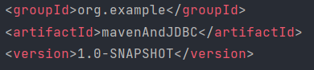
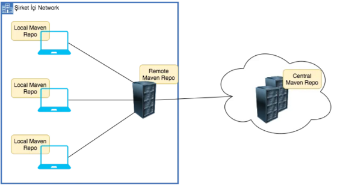
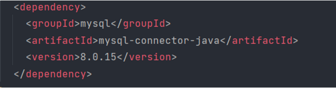

## :triangular_flag_on_post: Maven
<b>Maven genellikle Java platformunda yer alan komutların derlenmesi sırasında kullanılan otomasyon ve inşa aracıdır.
Java programlama dili ile uygulama geliştirirken çeşitli kütüphaneler kullanamak isteyebiliriz.
Her kütüphane için gerekli olan JAR dosyalarını indirmek ve projeye uygun olarak yerleştirmek (classpath) gerekir.

Ancak sadece kütüphanelerin indirilmesi ve projeye dahil edilmesi yetmeyecektir.

Ayrıca her yeni güncelleme sonrası güncel dosyaların takip edilmesi gerekecektir.

Maven proje dosyasına eklenen bağımlılıklar ile kolay bir şekilde indirmeyi ve proje yerleştirmeyi sağlar.</b>

### 🎯 POM (Project Object Model)

<p><b>Maven projelerinde proje konfigürasyonu POM adı verilen ve XML formatında saklanan dosya ile yönetilir. pom.xml adı verilen bu özel dosya proje ile ilgili tüm konfigürasyonu, bağımlılıkları ve build işlemi için gerekli olan pluginleri bünyesinde bulundurur.</b></p>



```java
<groupId>org.example</gruopId>
<artifactId>mavenAndJDBC</artifactId>
<version>1.0-SNAPSHOT</version>
```

- **groupId**

 <b>Uygulamanın ait olduğu organizasyonu gösterir, farklı uygulamalar arasında groupId çakışması    olmaması için genelde organizasyonun web adresinin ters sıralanması groupId olarak kullanılır (detaysoft.com -> com.detaysoft gibi).


- **artifactId**

 Uygulamanın ismi, organizasyon içinde benzersiz(unique) olmalıdır.


- **version**

 Uygulamanın versiyonunu belirtilmelidir.



Maven repositorysi projelerin ihtiyacı olan jar dosyalarını ve bu dosyalar ile ilgili meta verilerin saklandığı özel bir depolama alanı olarak düşünülebilir. Maven projelerin bağımlı oldukları kütüphaneleri bu depolama sistemi aracılığı ile yönetir.</b>

## 🎯 Dependency yönetimi
<p><p>Maven uygulamalarında bağımlılıklar yukarda pom.xml dosyasında gösterildiği gibi "<dependencies>" tagleri arasında, groupId, artifactId ve version bilgileri ile birlikte tanımlanır.</dependencies></p>

Maven dependency yönetiminin en güzel taraflarından biri de transitive dependency dediğimiz bağımlılığın ihtiyaç duyduğu bağımlılıkları de projeye dahil edebiliyor olmasıdır.</b></p>


<p><b>Örneğin ABC isimli bir kütüphaneye projede ihtiyacınız var ve ABC isimli kütüphane de çalışmak için XYZ isimli ve KLM isimli kütüphanelere ihtiyaç duyuyor. Aynı zamanda XYZ kütüphanesi ve KLM kütüphanesi de çalışmak için QWE kütüphanesine ihtiyaç duyuyorlar. İşte bu durumda ABC bizim için ana dependency, XYZ, KLM ve QWE ise transitive dependency oluyor. Maven tüm bu kütüphaneleri uygun versiyonlarını bularak kolayca projeye eklememizi sağlıyor.</b></p>


<b><i> :pushpin: Dependency işlemini öğrendiğimize göre projemizde kullandığımız JDBC örneği için bağımlılığı tek tek jar olarak eklemek yerine pom.xml’ de MySql bağımlılığına ihtiyacımız var ve şu şekilde ekleyip maven’ı güncelleyebilirsiniz.</i></b>



```java
<dependency>
<groupId>mysql</groupId>
<artifactId>mysql-connector-java</artifactId>
<version>8.0.15</version>
</dependency>
```

## 🎯 Maven build yaşam döngüsü

- **validate**

> projeyi doğrulamak ve gerekli olan tüm bilgileri sağladığından emin olmak için
>
- **compile**

> projenin kaynak kodunu derlemek için
>
- **test**

> projeye eklenen uygun unit test frameworkü kullanılarak testlerin çalıştırılması için
>
- **package**

> derlenmiş kodu alın ve JAR gibi dağıtılabilir bir biçimde paketleyin.
>
- **verify**

> entegrasyon testlerini koşmak için
>
- **install**

> yerel olarak diğer projelerde bir bağımlılık olarak kullanmak için paketi yerel depoya kurulmalıdır.
>
- **deploy**

> daha önce install fazında local repoya konulan paketi uzaktaki repoya koymak için
>
